  

  
  
  
  

  

  

  
  

    <a href="https://github.com/eduardocvalente/notificacoes-core-service"><b>▸ notificacoes-core-service</b></a> &nbsp;·&nbsp;
    <a href="https://github.com/eduardocvalente/gestao-matriculas-service"><b>▸ gestao-matriculas-service</b></a> &nbsp;·&nbsp;
    <a href="https://github.com/eduardocvalente/PrintManagerAPI"><b>▸ PrintManagerAPI</b></a>
     
    <a href="https://github.com/eduardocvalente/FastCep.Api"><b>▸ FastCep.Api</b></a> &nbsp;·&nbsp;
    <a href="https://eduardovalente.dev"><b>▸ dashboard do benchmark (TCC)</b></a> &nbsp;·&nbsp;
    <a href="https://github.com/eduardocvalente?tab=repositories"><b>todos os repositórios →</b></a>
  

  

  

