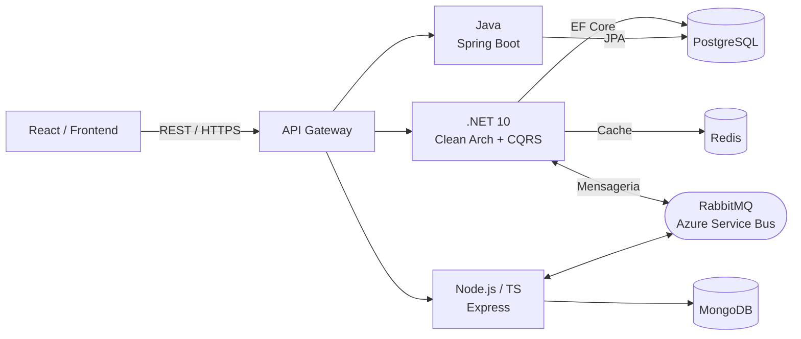

  <picture>
    <source media="(prefers-color-scheme: dark)" srcset="images/leao_light.svg">
    
  </picture>

<h1 align="center">Eduardo Costa Valente</h1>

  

  
  
  

---

## Sobre mim

Sou **Full Stack Engineer** com foco em backends robustos, arquitetura de microsserviços e código limpo. Formado em **Ciências Contábeis** (UEG) e cursando **Engenharia** (IFG — 9º período), com **MBA em Auditoria Digital & Direito Tributário**.

Combino visão analítica da contabilidade com a precisão da engenharia de software para construir sistemas financeiros e empresariais confiáveis e de alta performance.

- Localização: Goiânia — GO
- Idiomas: Português (Nativo) · Inglês (Intermediário)
- Especialidade: **.NET 10 · Node.js · Java** com **Clean Architecture, DDD, CQRS e Hexagonal**

---

## Stack

### Backend

### Frontend

### Banco de Dados

### ORM & Data Access

### Arquitetura & Padrões

### Infra & Cloud

### Testes

---

## Projetos em destaque

<table>
  <tr>
    <td width="50%" valign="top">
      <h3>notificacoes-core-service</h3>
      
Microsserviço de notificações com <strong>Arquitetura Hexagonal</strong>, <strong>RabbitMQ</strong>, <strong>MailKit</strong> e <strong>PostgreSQL</strong>.

      

        
        
        
      

    </td>
    <td width="50%" valign="top">
      <h3>gestao-matriculas-service</h3>
      
Microsserviço acadêmico com <strong>Clean Architecture</strong>, <strong>DDD</strong>, <strong>CQRS</strong>, <strong>MediatR</strong> e <strong>EF Core 9</strong>.

      

        
        
        
      

    </td>
  </tr>
  <tr>
    <td width="50%" valign="top">
      <h3><a href="https://github.com/eduardocvalente/PrintManagerAPI">PrintManagerAPI</a></h3>
      
API de gerenciamento de fila de impressão com <strong>Minimal APIs</strong>, fila <strong>FIFO</strong> e suporte Windows.

      

        
        
        
      

    </td>
    <td width="50%" valign="top">
      <h3><a href="https://github.com/eduardocvalente/FastCep.Api">FastCep.Api</a></h3>
      
Consulta de CEP performática com cache e fallback inteligente.

      

        
        
      

    </td>
  </tr>
</table>

---

## GitHub em números

  

  
  

---

## Arquitetura típica

---

  <i>"Código limpo é poesia que roda."</i> 
  <picture>
    <source media="(prefers-color-scheme: dark)" srcset="images/leao_light.svg">
    
  </picture>

